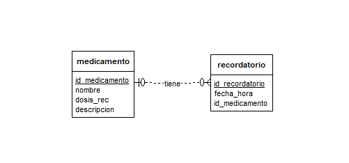
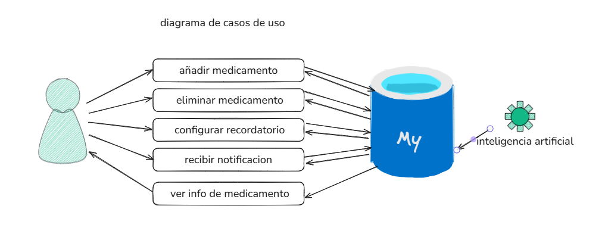

# SALUD-NOTIFICA

**Problema**

Muchas personas olvidan tomar sus medicamentos a tiempo, lo que puede afectar su salud y adherencia al tratamiento.
Esto es especialmente común entre personas mayores y aquellos con múltiples prescripcione
lo que puede resultar en complicaciones médicas y visitas innecesarias al médico.

**Solución**

- crear una aplicación que ayudara a recordar la toma de medicamentos a tiempo, mejorando la adherencia al tratamiento

**caracteristicas**
  - Notificaciones para recordatorios de medicamentos.
  - Registro de horarios de toma.
  - Opción para añadir o eliminar medicamentos.
  - Información sobre cada medicamento.

## TECNOLOGIAS UTILIZADAS
- trello
- figma
- vscode
- github pages
- reflex
- github 
- flet
...
### TRELLO 
visite nuestro entorno de trabajo en trello:
- [Accede a mi tablero de Trello aquí](https://trello.com/b/uNwjY4lj/salud-notifica)

### FIGMA 
disponible pronto:(aun en proceso)
- [Accede a mi prototipo Fimga aqui](https://www.figma.com/proto/mGWOYWnJRySQITUBlvMuqd/Untitled?node-id=0-1&t=lk7TiSkU31XsjnOJ-1)

## documentacion de la app
- [Accede a nuestra documentacion aqui](https://docs.google.com/document/d/1LAYQlI3tM7Kx_bdbvLiDuFmhGP5az5DR/edit?usp=sharing&ouid=109993899027822036845&rtpof=true&sd=true)

## DIAGRAMA DE ENTIDAD RELACION
- tambien conocido como diagrama logico de bd:

## DIAGRAMA DE CASOS DE USO
- las funcionalidades que tendra la aplicacion y como interactua con la base de datos:

## AUTOR
- ccaccachahua amao, ronal miguel
